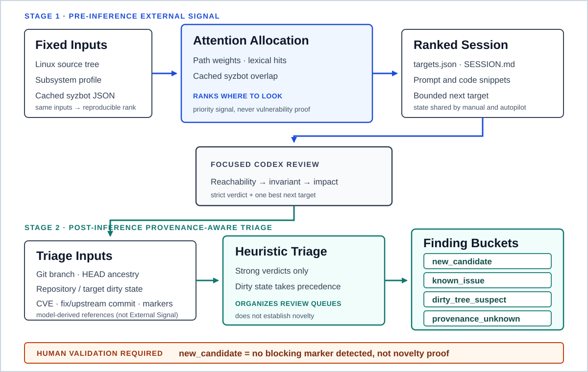

# Kernel Codex Harness v2

[한국어](README.md) | [English](README.en.md)

[](https://github.com/foxirain/linux-kernel-codex-harness-v2/actions/workflows/ci.yml)

<p align="center"><strong>Research Tool · Original Import: 3 April 2026 · v2 Documentation Revision: 11 July 2026</strong></p>

<p align="center"><strong>External Signal: From Attention Allocation to Provenance-Aware Triage</strong><br>Use reproducible observations to guide model attention, then use repository provenance to organize review queues—never to claim proof.</p>

> **Project Lineage—** [Kernel Codex Harness v1](https://github.com/foxirain/linux-kernel-codex-harness) · *Attention Allocation* → **Kernel Codex Harness v2** · *Provenance-Aware Triage*

> **Project status.** 이 저장소는 실제 Linux 커널 취약점 조사를 위해 v1의 attention-allocation workflow를 provenance-aware triage까지 발전시킨 LLM-assisted research harness입니다. 이 버전은 [CVE-2026-53075](https://nvd.nist.gov/vuln/detail/CVE-2026-53075)로 공개된 취약점을 발견하는 데 사용됐습니다. 자동 취약점 탐지기, 신규성 판정기, exploit 검증기 또는 커널 보안 보증 도구가 아니며, 최종 검증과 보고는 사람이 수행합니다.

## Abstract

**Abstract—** Linux 커널처럼 큰 코드베이스를 LLM에 그대로 탐색시키면 컨텍스트가 분산되고, 위험한 API의 존재와 실제 공격 가능성이 쉽게 혼동된다. `Kernel Codex Harness v2`는 이 문제를 두 단계의 **External Signal** 처리로 정의한다. 모델 호출 전에는 경로 weight, lexical hit, cached syzbot overlap으로 후보 파일을 순위화해 attention을 배분한다. 모델 응답 뒤에는 Git branch·HEAD·dirty state와 응답에서 추출한 CVE·commit·known marker를 결합해 strong finding을 provenance-aware review bucket으로 분류한다. 이 하네스는 실제 Linux 커널 조사에서 PPP의 target network namespace 권한 검증 결함을 발견하는 데 사용됐고, 해당 결함은 [CVE-2026-53075](https://nvd.nist.gov/vuln/detail/CVE-2026-53075)로 공개됐다. Triage는 조사 큐를 정리하는 heuristic이며, 특히 `new_candidate`는 알려진 단서나 provenance 문제를 발견하지 못했다는 뜻일 뿐 novelty proof가 아니다. 모든 finding은 userspace reachability, invariant break, concrete impact에 대한 사람의 재검증을 요구한다.

**Index Terms—** Linux kernel, vulnerability research, external signal, provenance, heuristic triage, LLM orchestration, syzbot, Codex.

## I. Introduction

커널 보안 검토에는 서로 다른 두 종류의 불확실성이 있다.

1. **어디를 먼저 볼 것인가.** 전체 소스 트리는 한 번의 모델 컨텍스트로 다루기에 너무 크다.
2. **모델이 낸 강한 finding을 어떻게 취급할 것인가.** 로컬 수정, 기존 fix, 알려진 CVE 또는 불완전한 repository state가 결론을 오염시킬 수 있다.

v1의 중심 문제는 첫 번째, 즉 attention allocation이었다. v2는 그 원칙을 유지하면서 두 번째 문제를 provenance-aware triage로 확장한다. 두 버전은 각각 실제 조사에 사용됐으며, v1-assisted investigation은 CVE-2026-31720으로, v2-assisted investigation은 CVE-2026-53075로 이어졌다.

> 모델 바깥의 관찰값으로 조사 범위를 좁히고, 모델 응답 뒤에는 검증 가능한 repository provenance를 붙인다. 어느 단계의 signal도 취약점 또는 신규성을 증명하지 않는다.

## II. External Signal and Design Principles

### A. Stage 1 — Attention Allocation Before Inference

Pre-inference External Signal은 LLM 판단이 아니라 모델 실행 전에 계산되는 관찰값이다.

- 커널 경로와 subsystem weight
- usercopy, allocator, refcount, size, lock 등 lexical hit
- 저장된 syzbot JSON의 file/subsystem overlap

같은 source tree, profile, cached syzbot JSON을 사용하면 candidate rank를 다시 계산할 수 있다. 이 점수는 확률이나 exploitability가 아니라 **어디를 먼저 볼지 정하는 상대적 순서**다.

### B. Stage 2 — Provenance-Aware Triage After Inference

Post-inference 단계는 strong model verdict에 다음 정보를 결합한다.

- Git repository 여부와 status 수집 성공 여부
- branch와 HEAD
- repository 및 target file의 dirty state
- 응답에서 추출한 CVE, commit hash, known-issue marker
- 응답에 나타난 negation 또는 unrelated-reference 표현

이 문서에서 **post-inference External Signal**은 Git repository/status, branch, HEAD, dirty state, local commit ancestry처럼 모델과 독립적으로 수집한 provenance만 가리킨다. CVE·commit·known marker는 모델 응답에서 추출한 **model-derived reference**이며 External Signal이나 authoritative fact가 아니다. Triage는 두 종류의 입력을 결합하되 그 출처를 구분해 기록한다.

### C. Heuristic Buckets, Not Novelty Proof

Strong finding은 운영상 다음 review bucket 중 하나로 정리된다.

| Bucket | Meaning |
| --- | --- |
| `new_candidate` | provenance가 확인되고 dirty/known blocking signal이 발견되지 않은 후보 |
| `known_issue` | non-negated known reference 또는 응답이 fix/upstream 관계로 지목하고 현재 HEAD에 포함된 commit이 확인된 후보 |
| `dirty_tree_suspect` | dirty repository 또는 dirty target의 영향을 배제할 수 없는 후보 |
| `provenance_unknown` | Git repository, status 또는 HEAD를 신뢰성 있게 확인하지 못한 후보 |

모든 분류 결과의 `novelty_proven`은 `false`다. `new_candidate`는 “새 취약점”이 아니라 **우선 사람이 신규성 조사를 계속할 큐**를 뜻한다.

### D. Reachability Before Bug Class

감사는 `syscall`, `ioctl`, `netlink`, `procfs`, filesystem, BPF, driver hook처럼 userspace에서 시작되는 경계를 먼저 확인한다. 이후에야 UAF, OOB, refcount, race, info leak, capability check 같은 bug class를 평가한다.

### E. One Investigation Branch at a Time

한 조사 단위는 하나의 파일과 가까운 caller·teardown·free path로 제한한다. 모델이 제안하는 manual follow-up은 최대 두 번으로 제한해 broad exploration보다 검증 가능한 짧은 경로를 유지한다.

### F. Evidence Over Confidence

강한 finding은 최소한 다음을 설명해야 한다.

1. attacker-reachable entrypoint,
2. attacker-controlled field 또는 lifetime transition,
3. 깨지는 object·length·state invariant,
4. corruption, leak, privilege escalation 등 구체적인 impact,
5. 기존 check가 공격을 막지 못하는 이유.

Parser는 verdict와 next target을 정규화할 뿐 이 증거의 완결성을 자동 증명하지 않는다.

### G. Design Lineage

초기 흐름은 Protect AI의 `vulnhuntr`가 사용한 파일 단위 분석, 제한된 컨텍스트 확장, 구조화된 결과물이라는 발상에서 출발했다 [1]. 이 프로젝트에서는 이를 userspace-reachable kernel surface, 커널 객체 lifetime, teardown path, syzbot overlap에 맞게 다시 설계했다. v2의 추가 기여는 **attention allocation 뒤에 repository provenance를 이용한 finding triage 단계를 둔 것**이다.

## III. System Architecture

<p align="center">
  
</p>

<p align="center"><strong>Fig. 1.</strong> Pre-inference External Signal ranks reproducible review units. Post-inference triage combines model-independent Git provenance with model-derived response references, without treating the latter as External Signal or authoritative fact. Human validation remains outside both automated stages.</p>

**TABLE I — MAJOR MODULE RESPONSIBILITIES**

| Module | Responsibility |
| --- | --- |
| `targeting.py` | 커널 파일 탐색과 path·lexical·syzbot 신호 점수화 |
| `models.py` | `Candidate`, `Signal`, syzbot-derived `ExternalSignal` |
| `bundle.py` | manifest, session index, prompt/snippet bundle 생성 |
| `prompting.py` | reachability와 invariant 중심의 커널 감사 프롬프트 |
| `session.py` | pending review, history, follow-up depth 상태 저장 |
| `ingest.py` | strict verdict와 single next target 정규화 |
| `repo_state.py` | Git branch, HEAD, status, dirty path, ancestry 수집 |
| `finding_triage.py` | provenance와 known-reference 기반 heuristic bucket 분류 |
| `autopilot.py` | 시간 예산 기반 Codex 실행, ingest, archive, finding 기록 |
| `syzbot.py` | 공개 syzbot HTML 수집과 로컬 JSON cache 생성 |
| `cli.py` | scan/review/doctor/autopilot 명령 연결 |

## IV. Methodology

### A. Candidate Discovery and Scoring

스캐너는 profile의 include directory 아래 `.c`와 `.h` 파일을 순회한다.

```text
Score(f) = Σ path_weight(f)
         + Σ line_signal_weight(f)
         + Σ syzbot_overlap_weight(f)
```

현재 구현은 line-level match를 합산하고 prompt에 표시할 상위 신호 수만 제한한다. score는 모델의 조사 순서를 정하지만 vulnerability likelihood를 보정한 통계값은 아니다.

주요 정적 신호는 다음과 같다.

- ioctl, compat handler, file operation hook
- copy_from/to_user와 `__user`
- kmalloc/kzalloc/kvmalloc, cache allocation과 free path
- refcount, atomic, kref
- size·length 계산과 memcpy 계열
- lock, RCU, async lifetime
- BPF, skb, XDP, netlink
- capability와 namespace check

### B. Profile-Driven Scope

| Profile | Focus |
| --- | --- |
| `default` | kernel/mm/net/fs/security/io_uring/lib/drivers 시작점 |
| `net` | netlink, socket, skb, XDP |
| `fs` | ioctl, procfs, seq_file, debugfs |
| `io_uring` | async request lifetime과 teardown |
| `bpf` | verifier, map/program lifetime, BTF |
| `drivers` | ioctl, DMA, MMIO와 driver teardown |

### C. Crash Intelligence

`syzbot-fetch`는 공개 syzbot bug page에서 title, subsystem, bug type, file:line을 추출해 JSON으로 저장한다. exact file overlap은 강한 ranking signal, subsystem overlap은 약한 signal로 사용한다. Live dashboard는 변할 수 있으므로 재현 단위는 fetch 시점의 저장된 JSON이다. Crash overlap은 variant hunting의 힌트이지 취약점 증거가 아니다.

### D. Session and Review Contract

`scan`은 전체 ranked candidate manifest와 상위 prompt bundle을 생성한다. `--limit`은 manifest에 유지할 candidate 수이고 `--top`은 미리 생성할 bundle 수다. 이후 rank도 요청 시 생성할 수 있다.

모델 응답은 다음 verdict 중 하나로 정규화된다.

- `cve_candidate`
- `plausible_security_bug`
- `latent_bug`
- `not_cve_candidate`
- `needs_more_context`

수동 review와 autopilot은 같은 `review_state.json`, fixed response path, verdict parser를 사용한다.

### E. Provenance Collection and Triage

`doctor`와 autopilot은 Git repository 여부, status 수집 성공 여부, branch, HEAD, dirty path를 확인한다. Provenance를 확정할 수 없는 상태는 clean으로 간주하지 않고 `provenance_unknown`으로 보존한다.

Strong verdict의 triage는 대략 다음 우선순위를 따른다.

1. provenance를 신뢰할 수 없으면 `provenance_unknown`,
2. repository 또는 target이 dirty면 `dirty_tree_suspect`,
3. related CVE·non-negated marker가 있거나, 응답이 fix/upstream 관계로 지목한 commit이 현재 HEAD ancestor이면 `known_issue`,
4. 그렇지 않으면 `new_candidate`.

“not a known issue”, “unrelated to CVE-…” 같은 부정·비관련 표현은 known 근거로 사용하지 않는다. 최종 판정에는 원래 verdict와 함께 branch, HEAD, status, dirty state, matched reference와 reason을 남긴다.

현재 provenance-aware bucket 분류와 JSONL writer는 autopilot ingest 경로에 적용된다. 수동 `loop`와 `ingest`는 같은 기본 session state와 verdict parser를 사용하지만 bucket artifact를 만들지는 않는다.

## V. Implementation and Usage

### A. Requirements

- Python 3.11 이상
- Linux kernel source tree
- provenance/doctor/autopilot 사용 시 Git
- autopilot 사용 시 Codex CLI와 인증 [3]
- 원격 syzbot 수집 시 네트워크 연결

Python runtime dependency는 표준 라이브러리뿐이다.

### B. Installation

```bash
git clone https://github.com/foxirain/linux-kernel-codex-harness-v2.git
cd linux-kernel-codex-harness-v2

python3 -m venv .venv
source .venv/bin/activate
python -m pip install .
kernel-harness --help
```

내장 profile JSON은 wheel에 포함된다. 별도 규칙은 `--config /path/to/profile.json`으로 전달할 수 있다.

### C. Minimal Workflow

```bash
# 1. Verify repository provenance.
kernel-harness doctor /path/to/linux

# 2. Create a ranked session.
kernel-harness scan /path/to/linux \
  --profile net \
  --limit 80 \
  --top 20 \
  --out artifacts

# 3. Inspect and render one focused review.
kernel-harness inspect artifacts/session-YYYYMMDDTHHMMSSZ --top 10
kernel-harness codex artifacts/session-YYYYMMDDTHHMMSSZ \
  --rank 1 \
  --include-snippet
```

수동 Codex 응답은 runbook이 지정한 `codex_response.txt`에 저장한 뒤 다음 명령으로 ingest할 수 있다.

```bash
kernel-harness loop artifacts/session-YYYYMMDDTHHMMSSZ --include-snippet
kernel-harness status artifacts/session-YYYYMMDDTHHMMSSZ
```

### D. Time-Budgeted Autopilot

```bash
kernel-harness autopilot artifacts/session-YYYYMMDDTHHMMSSZ \
  --duration 30m \
  --per-run-timeout 10m \
  --include-snippet \
  --require-clean-tree \
  --stop-on-finding
```

Codex sandbox 기본값은 `read-only`다. `--require-clean-tree`는 Git repository, status, HEAD가 확인되고 working tree가 clean일 때만 실행을 허용한다. `--stop-on-finding`은 heuristic triage 결과가 `new_candidate`일 때만 멈춘다.

### E. Optional syzbot Feed

```bash
kernel-harness syzbot-fetch https://syzkaller.appspot.com/upstream \
  --out artifacts/syzbot/upstream.json \
  --limit 50

kernel-harness syzbot-stats artifacts/syzbot/upstream.json --top 15

kernel-harness scan /path/to/linux \
  --profile fs \
  --syzbot-json artifacts/syzbot/upstream.json \
  --out artifacts
```

### F. Session Artifacts

```text
artifacts/session-<timestamp>/
├── SESSION.md
├── targets.json
├── finding_template.json
├── review_state.json
├── codex_response.txt              # response가 pending일 때 존재
├── bundles/
├── responses/
└── autopilot/
    ├── AUTOPILOT_STATUS.txt
    ├── AUTOPILOT_PROGRESS.txt
    ├── AUTOPILOT_BASELINE.json
    ├── AUTOPILOT_FINDINGS.txt
    ├── AUTOPILOT_FINDINGS_NEW.txt
    ├── AUTOPILOT_KNOWN_ISSUES.txt
    ├── AUTOPILOT_SUSPECTS.txt
    ├── AUTOPILOT_PROVENANCE_UNKNOWN.txt
    ├── AUTOPILOT_FINDINGS.jsonl
    ├── prompts/
    ├── exec/
    ├── parse_errors/
    └── findings/
        ├── new/
        ├── known/
        ├── suspects/
        └── unknown/
```

`AUTOPILOT_FINDINGS.jsonl`은 verdict, bucket, reason, branch, HEAD, provenance 상태, matched reference, finding/archive 경로를 후처리 가능한 형태로 보존한다.

## VI. Operational Outcome and Verification

v2는 확장된 구조를 실제 Linux 커널 취약점 조사에 적용했다.

**TABLE II — DISCLOSED VULNERABILITY OUTCOME**

| Public outcome | Affected area | Severity / CVSS | Vulnerability | Investigation model |
| --- | --- | --- | --- | --- |
| [CVE-2026-53075](https://nvd.nist.gov/vuln/detail/CVE-2026-53075) | PPP · `drivers/net/ppp/ppp_generic.c` |  **8.8 · CVSS 3.1** (Linux CNA) | Unattached administrative ioctls lacked a `CAP_NET_ADMIN` check against the user namespace owning the target network namespace | Finding surfaced during a v2-assisted investigation; validation and disclosure remained human-led |

<details>
<summary><strong>CVSS 출처 (2026-08-09 확인)</strong></summary>

- `CVE-2026-53075`: [Linux CNA CVE record](https://www.cve.org/CVERecord?id=CVE-2026-53075) · CVSS 3.1 · 8.8 High · `CVSS:3.1/AV:L/AC:L/PR:L/UI:N/S:C/C:H/I:H/A:H`
- 공식 공개 점수와 vector를 옮겼으며 별도로 재산정하지 않았다.

</details>

16개의 regression test는 보안 탐지 정확도 benchmark가 아니라 software contract와 배포 가능성에 초점을 둔다.

- allocator와 built-in profile resource 회귀
- negative verdict와 일반 prose의 CVE 표현이 strong finding으로 뒤집히지 않는지
- manual follow-up 제한과 rank ordering
- pending target 없는 stale response archive
- read-only sandbox 기본값과 positive CLI argument
- missing/non-Git/status-failure의 fail-closed provenance
- dirty target, known reference, negation, unrelated CVE triage
- classification metadata의 session history 및 JSONL 보존
- parse-error와 finding artifact 계약
- installed wheel에서 profile scan smoke test

```bash
python -m unittest discover -s tests -v
python -m pip wheel . --no-deps --wheel-dir dist
python -m pip install --force-reinstall dist/*.whl
```

GitHub Actions는 Python 3.11과 3.12에서 regression test를 실행하고 wheel을 설치한 뒤 6개 packaged profile과 default scan을 smoke-test한다. 위 공개 사례는 실제 조사에서 얻은 operational outcome이지만 대표 Linux tree corpus에서 측정한 precision, recall, exploitability 또는 CVE discovery rate benchmark는 아니다.

## VII. Safety Considerations

- Codex sandbox 기본값은 `read-only`이며 유지하는 것을 권장한다.
- clean provenance가 중요하면 `doctor` 후 `--require-clean-tree`를 사용한다.
- non-Git 또는 status/HEAD 확인 실패를 clean으로 해석하지 않는다.
- `--dangerously-bypass-approvals-and-sandbox`는 격리된 실험 환경이 아니면 사용하지 않는다.
- source comment와 identifier도 모델 입력이므로 prompt injection 가능성을 고려한다.
- CVE·commit 문자열은 응답 reference일 뿐 authoritative confirmation이 아니다.
- finding 공개 또는 보고 전 사람이 reachability, invariant, impact, affected version을 다시 검증한다.

## VIII. Limitations and Threats to Validity

1. **Lexical analysis.** 실제 C AST, call graph, interprocedural data flow를 구축하지 않는다.
2. **Score bias.** 주석, 매크로, 반복 token, 큰 파일이 점수에 과도한 영향을 줄 수 있다.
3. **Reachability gap.** kernel config, privilege, namespace, device availability를 자동 모델링하지 않는다.
4. **External data fragility.** syzbot integration은 공개 HTML 구조 변경의 영향을 받는다.
5. **Local provenance only.** Git ancestry는 현재 checkout의 HEAD를 기준으로 하며 모든 upstream·vendor history를 대변하지 않는다.
6. **Response-derived references.** CVE와 known marker는 모델 응답에서 추출되므로 누락·환각·문맥 오해 가능성이 있다.
7. **Heuristic triage.** `new_candidate`와 `known_issue` 모두 최종 신규성 판정이 아니다.
8. **Model dependence.** 결과 품질은 모델, prompt interpretation, available repository context에 의존한다.
9. **Evaluation scope.** 현재 테스트는 software regression을 검증한다. 공개된 CVE 사례는 실제 사용 결과이지만 security detection 성능에 대한 통계적 평가를 대체하지 않는다.

## IX. Evolution and Retrospective

v1([repository](https://github.com/foxirain/linux-kernel-codex-harness))은 **External Signal로 LLM attention을 배분하는 문제**에 집중했고, 실제 v1-assisted 조사에서 [CVE-2026-31720](https://nvd.nist.gov/vuln/detail/CVE-2026-31720)을 발견하는 데 사용됐다. v2는 동일한 연구 철학을 이어 모델이 strong finding을 낸 뒤에도 repository state와 response-derived reference를 함께 기록하도록 확장했다. 이 구조를 사용한 후속 조사에서는 [CVE-2026-53075](https://nvd.nist.gov/vuln/detail/CVE-2026-53075)가 발견됐다.

```text
v1: source observations → rank → focused review
v2: source observations → rank → focused review → provenance-aware triage
```

이 발전에서 유지해야 할 원칙은 두 가지다.

1. pre-inference score를 vulnerability proof로 오해하지 않는다.
2. post-inference bucket을 novelty proof로 오해하지 않는다.

지금 다시 확장한다면 Clang/tree-sitter call graph, score normalization, versioned manifest와 inter-process state locking, authoritative CVE/fix database adapter, runner·triage·artifact writer 분리를 우선한다. 현재 state write 자체는 temporary file과 atomic replace를 사용한다.

## X. Conclusion

`Kernel Codex Harness v2`는 취약점 탐지를 대체하지 않는다. 모델 호출 전 External Signal은 조사 예산을 설명 가능한 후보에 배분하고, 모델 호출 후 provenance signal은 strong finding을 검토 가능한 큐로 정리한다. 이 구조는 실제 조사에서 CVE-2026-53075 발견에 사용됐으며, 프로젝트의 핵심 결과는 신규성을 자동 판정하는 알고리즘이 아니라 **attention allocation과 provenance-aware triage를 명시적으로 분리한 실전 LLM 보안 검토 workflow**다.

## Appendix A. Repository Layout

```text
.
├── .github/workflows/ci.yml
├── docs/
│   ├── assets/kernel-harness-v2-architecture.svg
│   ├── AUTOPILOT.md
│   ├── CODEX_CLI.md
│   ├── CODEX_WORKFLOW.md
│   └── SYZBOT.md
├── kernel_harness/
│   ├── resources/
│   │   ├── linux-kernel-default.json
│   │   └── profiles/
│   │       ├── bpf.json
│   │       ├── drivers.json
│   │       ├── fs.json
│   │       ├── io_uring.json
│   │       └── net.json
│   ├── __init__.py
│   ├── __main__.py
│   ├── autopilot.py
│   ├── bundle.py
│   ├── cli.py
│   ├── finding_triage.py
│   ├── ingest.py
│   ├── models.py
│   ├── prompting.py
│   ├── repo_state.py
│   ├── session.py
│   ├── syzbot.py
│   └── targeting.py
├── tests/test_regressions.py
├── .gitignore
├── README.md
└── pyproject.toml
```

세부 수동 운영은 [Codex CLI guide](docs/CODEX_CLI.md), 자동 실행과 triage는 [Autopilot guide](docs/AUTOPILOT.md), crash intelligence는 [syzbot guide](docs/SYZBOT.md)에서 확인할 수 있다.

## References

[1] Protect AI, “vulnhuntr,” GitHub repository. <https://github.com/protectai/vulnhuntr>

[2] Google, “syzkaller and syzbot,” GitHub repository. <https://github.com/google/syzkaller>

[3] OpenAI, “Codex CLI.” <https://developers.openai.com/codex/cli/>

## License

Licensed under the [Apache License 2.0](LICENSE).
